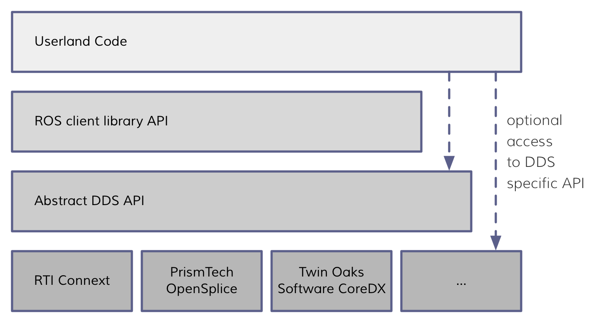

# DDS in ROS2

source : https://design.ros2.org/articles/ros_on_dds.html

## What is DDS ?

1.  DDS(**Data Distribution Service**) provides a **publish-subscribe transport** which is very similar to ROS’s publish-subscribe transport.
2.  DDS uses the “Interface Description Language (IDL)” as defined by the [Object Management Group (OMG)](http://www.omg.org/) for message definition and serialization

## Technical Credibility

1.  Since DDS is implemented, by default, on UDP, it does not depend on a reliable transport or hardware for communication.
2.  This means that DDS has to reinvent the reliability wheel (basically TCP plus or minus some features), but in exchange DDS gains portability and control over the behavior.
3.  Control over several parameters of reliability, what DDS calls Quality of Service (QoS), gives maximum flexibility in controlling the behavior of communication. For example, if you are concerned about latency, like for soft real-time, you can basically tune DDS to be just a UDP blaster. In another scenario you might need something that behaves like TCP, but needs to be more tolerant to long dropouts, and with DDS all of these things can be controlled by changing the QoS parameters.

## DDS vs RTPS

### 1\. DDS

- It provides a **high-level API** with advanced features such as Quality of Service (QoS), discovery, durability, and security.
- It includes the RTPS protocol for transport but adds additional layers and functionalities.

### 2\. RTPS

- RTPS(**Real-Time Publish-Subscribe Protocol**) is a lower-level protocol that defines how data is exchanged over the network.
- It is the **wire protocol** used by DDS to enable communication between different nodes.

For example, **eProsima Fast DDS** allows developers to work closer to the RTPS layer rather than going through the complete DDS API stack, making it more lightweight. Implementations that work **directly with RTPS** can **reduce overhead** and still provide the necessary features for ROS 2.

## Why DDS ?

### Discovery

DDS would completely replace the ROS master based discovery system. ROS would need to tap into the DDS API to get information like a list of all nodes, a list of all topics, and how they are connected. Accessing this information would be hidden behind a ROS defined API, preventing the users from having to call into DDS directly.

The advantage of the DDS discovery system is that, by default, it is completely distributed, so there is no central point of failure which is required for parts of the system to communicate with each other. DDS also allows for user defined meta data in their discovery system, which will enable ROS to piggyback higher level concepts onto publish-subscribe.

## Message Transmission

### 1\. ROS 1 (TCP based communication)

- Messages are **serialized** (converted into a byte stream).
- The entire message is stored in **one large buffer**.
- The system then calls **TCP’s `send()`** once to send the entire buffer over the network.
- TCP ensures **reliable and ordered** transmission, but it has some overhead (e.g., handshaking, error checking, congestion control).

### 2\. ROS 2 with DDS (UDP based communication

- Messages are **serialized** similarly.
- However, instead of sending one large buffer, DDS over **UDP may fragment** the message into multiple smaller UDP packets.
- These packets are sent **individually** using multiple calls to `send()` on the UDP socket.
- Unlike TCP, UDP is **connectionless** and does not guarantee ordering or reliability, so DDS handles these aspects internally.

➜ **Issue**: Sending multiple UDP packets is generally **less efficient than a single large TCP send**, especially in local communication.

### ➜ **Resolving the Issue:-**

- Many **DDS vendors optimize inter-process communication** on the same machine by avoiding network overhead.
- Instead of sending UDP packets (even over `localhost`), they use a **shared-memory mechanism** (like a blackboard-style memory region).
- This allows different processes to **read and write messages directly in memory** rather than sending them through the network stack.
- The result is **much faster local communication** in ROS 2 compared to using UDP sockets.

### ➜ But:-

- ROS 2 cannot depend on vendor-specific optimizations, so a more universal solution is needed.
    
- If ROS 2 **relies purely on DDS for IPC**, every intra-process message would still need to be **converted to a DDS message type**.
    
- This conversion adds unnecessary **serialization and deserialization overhead** when messages stay inside the same process.
    
- Instead of using standard DDS topics for intra-process communication, **ROS 2 introduces a special intra-process system**.
    
- This system **does not serialize or copy messages** at all.
    
- Instead, it **passes pointers directly** between publishers and subscribers.
    
- The data remains in **shared in-process memory**, making intra-process communication **extremely fast** compared to serialization over DDS.
    

## Message Conversion

### Concern About Performance of Field-by-Field Copying

- Initially, one might think that converting a message **field-by-field** (e.g., copying each field from a ROS message to a DDS message) would be **too slow**.
- However, experiments show that this **copying process is much faster** than serialization.
- The **overhead of field-by-field copying** is **at least 10x lower** than the cost of full serialization.

### Serialization is the Real Bottleneck

- Once a message is converted, it still needs to be **serialized into a binary format** before being sent over the network.
- Serialization (especially in traditional libraries) is significantly more expensive than simply copying fields in memory.
- The **only exception** is **Cap’n Proto**, which eliminates the need for serialization altogether.

### Implication: If Copying is Too Slow, So is Serialization

- If your application **cannot tolerate** a field-by-field copy, it **definitely cannot tolerate serialization** either.
- In such a case, you should **avoid network transport altogether** and instead use:
    - **Intra-process communication** (within the same process)
    - **Zero-copy inter-process communication** (between processes on the same machine without serialization)

### How ROS 2 Handles This

- ROS 2 **does not** use the DDS in-memory representation for intra-process communication.
- This means that **field-by-field copying only happens when sending data over the network**, not when passing messages within the same process.
- Since this copying step is always followed by a much more expensive serialization step, it is considered an **acceptable trade-off** for keeping **ROS message formats portable and abstract**.

&nbsp;